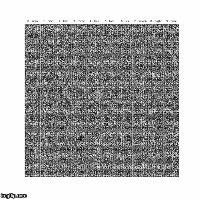

# Conditional DCGAN

This repository contains a Pytorch implementation of Conditional DCGAN tested on 2 datasets:
* MNIST
* CIFAR-10

 

**Note** that the model architecture is not precisely the same as in the original DCGAN paper
[Unsupervised Representation Learning with Deep Convolutional Generative Adversarial Networks](https://arxiv.org/abs/1511.06434).

## Installation

Clone the repo by running:
```shell script
git clone https://github.com/dfridman1/Conditional-DCGAN.git DCGAN-Pytorch
```

 After cloning the repository create a virtual environment and install prerequisite packages:
 ```shell script
cd DCGAN-Pytorch
virtualenv venv -p python3.7 
source venv/bin/activate
./install.sh
```

## Training
`train.py` script launches training and dumps generated images to a specified folder. In order to see
the command-line arguments the script takes, run:
```shell script
python train.py --help
```

Here is a description of the arguments:
* **Required**:
    - `--experiment_dirpath (str)`
    - `--experiment_name (str)`: the generated images are saved to `experiment_dirpath/experiment_name`
    - `--dataset (one of mnist, cifar10)`
    - `--dataset_dir (str)`: the dataloader will try to fetch the dataset from this directory; if not found, the dataset will be downloaded to this directory
* *Optional*:
    - `--gpu_id (int)`: if specified, the training takes place on `cuda:gpu_id`; on CPU, otherwise
    - `--image_size (int)`: the size of the generated images; if not specified, the size will be as in the dataset the model is trained on (28 for MNIST, 32 for CIFAR-10)
    - `--train_iters (int)`
    - `--lr (float)`
    - `--show_every (int)`: images will be generated and saved every `show_every` iterations
    - `--z_dim (int)`: the size of the noise vector passed to the generator
    - `--k (int)`: for every training iteration of the generator, `k` iterations will be run for the discriminator
    - `--no_conditional (flag)`: the vanilla (non-conditional) DCGAN will be trained
    - `--l2_loss (flag)`: instead of binary cross entropy, L2 loss will be optimized
    - `--no_label_smoothing (flag)`

An example run:
```shell script
python train.py --gpu_id 0 \
                --dataset mnist \
                --dataset_dir data \
                --experiment_dirpath experiments \
                --experiment_name my_first_experiment \
                --train_iters 2000 \
                --show_every 100 \
                --l2_loss
```

The generated images will be dumped to `experiments/my_first_experiment`.